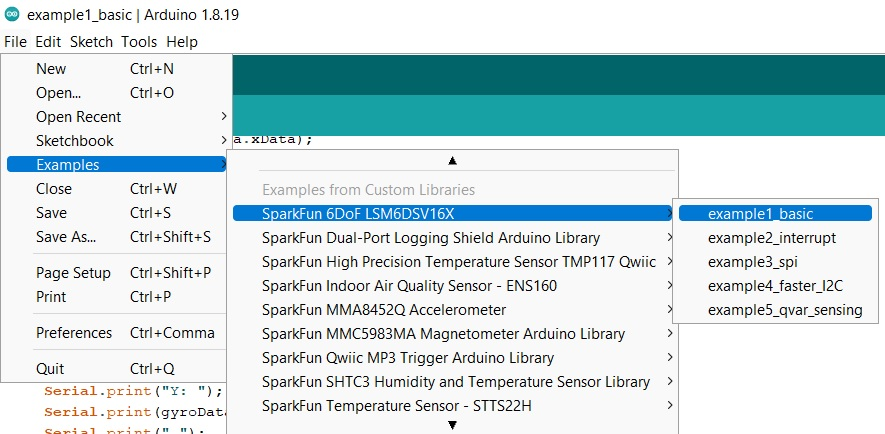
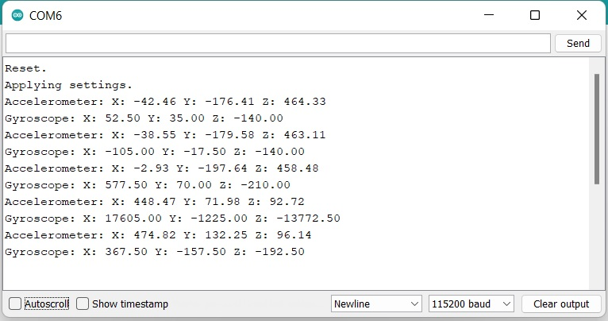
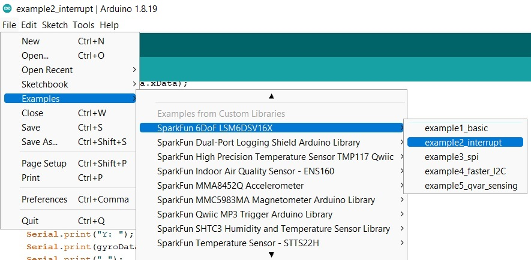
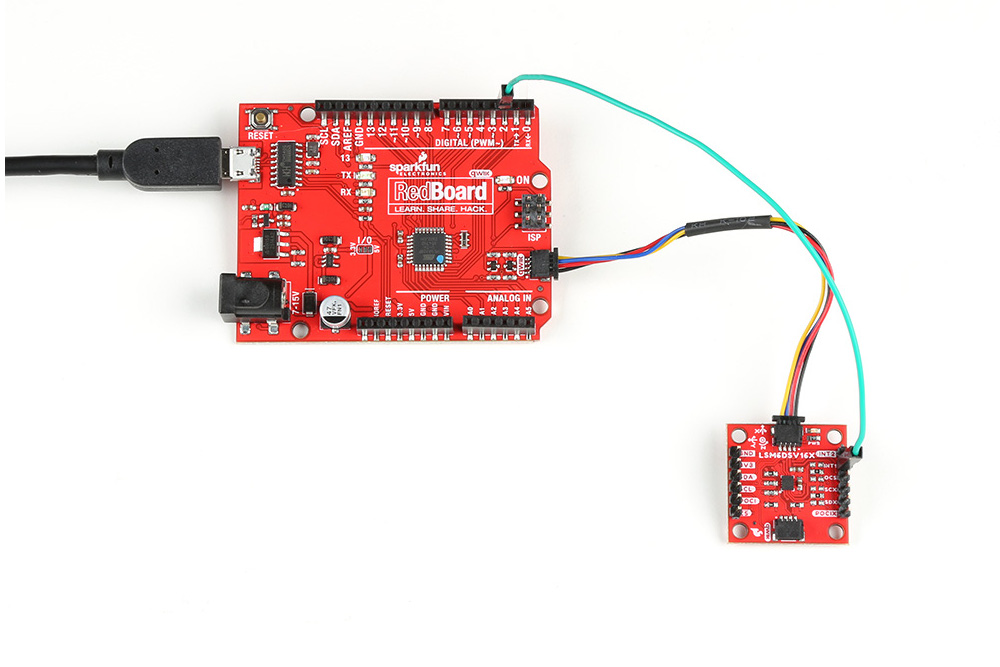
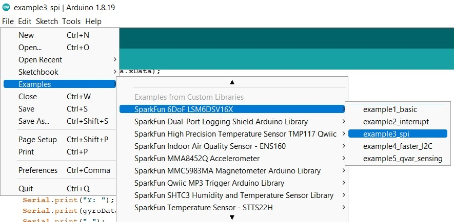
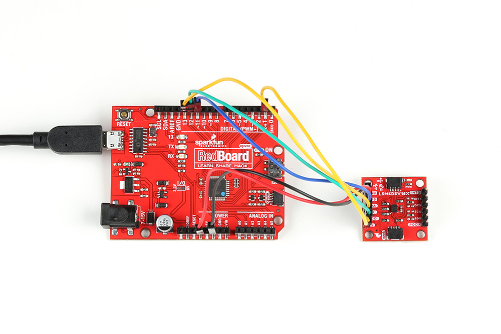
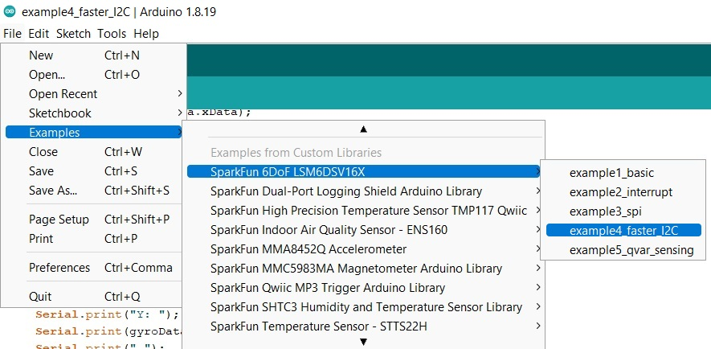
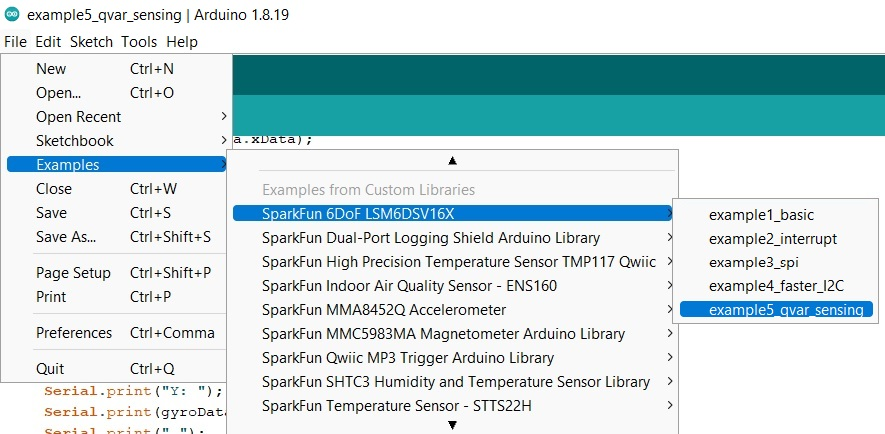

###Example 1: Basic Readings

This first example just does some basic measurements. To find Example 1, go to **File** > **Examples** > **SparkFun 6DoF LSM6DSV16X** > **example1_basic**:


<figure markdown>
[{ width="90%" }](assets/imgs/Example1_Menu.jpg "Click to enlarge")
<figcaption markdown>Finding Example 1</figcaption>
</figure>

Alternatively, you can expand the link below and copy and paste the code into a shiny new Arduino sketch: 

??? "Example 1 Arduino Code"
	```
	--8<-- "https://raw.githubusercontent.com/sparkfun/SparkFun_STTS22H_Arduino_Library/main/examples/example1-basic/example1-basic.ino"
	```

<!-- 
	https://github.com/sparkfun/SparkFun_LSM6DSV16X_Arduino_Library/blob/main/examples/example1_basic/example1_basic.ino
-->

Make sure you've selected the correct board and port in the Tools menu and then hit the upload button. Once the code has finished uploading, go ahead and open a [Serial Monitor](https://learn.sparkfun.com/tutorials/terminal-basics). You should see something similar to the following. Note the obvious changes where the sensor was turned upright. 

<figure markdown>
[{ width="90%" }](assets/imgs/Example1_Output.jpg "Click to enlarge")
<figcaption markdown>Example 1 Output</figcaption>
</figure>


###Example 2: Interrupt

This example shows the basic settings and functions for retrieving accelerometer data. In addition we're setting the data ready signal to interrupt pin one in an active high configuration and show additional ways in which the interrupts can be configured. To find Example 2, go to **File** > **Examples** > **SparkFun 6DoF LSM6DSV16X** > **example2_interrupt**. 

<figure markdown>
[{ width="90%" }](assets/imgs/Example2_Menu.jpg "Click to enlarge")
<figcaption markdown>Finding Example 2</figcaption>
</figure>

Alternatively, you can expand the link below and copy and paste the code into a shiny new Arduino sketch: 


??? "Example 2 Arduino Code"
	```
	--8<-- "https://raw.githubusercontent.com/sparkfun/SparkFun_STTS22H_Arduino_Library/main/examples/example1-basic/example1-basic.ino"
	```


<!-- 
	https://github.com/sparkfun/SparkFun_LSM6DSV16X_Arduino_Library/blob/main/examples/example2_interrupt/example2_interrupt.ino
-->

Your setup should resemble something like this: 

<figure markdown>
[{ width="90%" }](assets/imgs/Example2_Wiring.jpg "Click to enlarge")
<figcaption markdown>Example 2</figcaption>
</figure>

Again, make sure you've selected the correct board and port in the Tools menu and then hit the upload button. Once the code has finished uploading, go ahead and open a [Serial Monitor](https://learn.sparkfun.com/tutorials/terminal-basics). You should see something similar to the following.


###Example 3: SPI

 This example shows the basic settings and functions for retrieving accelerometer and gyroscopic data but using the SPI interface. Everything other than that is identical to the "basic" example. To find Example 3, go to **File** > **Examples** > **SparkFun 6DoF LSM6DSV16X** > **example3_spi**:

<figure markdown>
[{ width="90%" }](assets/imgs/Example3_Menu.jpg "Click to enlarge")
<figcaption markdown>Finding Example 3</figcaption>
</figure>

Alternatively, you can expand the link below and copy and paste the code into a shiny new Arduino sketch: 


??? "Example 3 Arduino Code"
	```
	--8<-- "https://raw.githubusercontent.com/sparkfun/SparkFun_STTS22H_Arduino_Library/main/examples/example1-basic/example1-basic.ino"
	```

The wiring for this example is fairly straight forward, if somewhat ugly. Here's what it looks like:

<figure markdown>
[{ width="90%" }](assets/imgs/Example3_Wiring.jpg "Click to enlarge")
<figcaption markdown>Example 3</figcaption>
</figure>


And here are the connections:
<center>
<table>
    <th colspan="2" align="center"><b>Pin Connections</b></th>
    <tr align="center">
        <td><b>Qwiic Breakout Pin</b></td>
        <td><b>RedBoard Pin</b></td>    
    </tr>   
    <tr align="center">
        <td>PICO</td>
        <td>11</td>
    </tr>
    <tr align="center">
        <td>POCI</td>
        <td>12</td>       
    </tr> 
    <tr align="center">
        <td>SCLK</td>
        <td>13</td>
    </tr>
    <tr align="center"> 
        <td>CS</td> 
        <td>A4</td>
    </tr>
</table>
</center>

<!-- 
	https://github.com/sparkfun/SparkFun_LSM6DSV16X_Arduino_Library/blob/main/examples/example3_spi/example3_spi.ino
-->

<!-- Starting comment of example 4
###Example 4: Basic Readings

 This example shows how to retrieve accelerometer and gyroscopic data as fast as the I2C bus will allow.

 If you want to run the accel and gyro at 416Hz, you need to use 400kHz I2C. See the Wire.setClock(400000); at the start of setup().

 This example also allows you to run the accel and gyro at different rates,
 should you want to. To find Example 4, go to **File** > **Examples** > **SparkFun 6DoF LSM6DSV16X** > **example4_faster_I2C**:

<figure markdown>
[{ width="90%" }](assets/imgs/Example4_Menu.jpg "Click to enlarge")
<figcaption markdown>Finding Example 4</figcaption>
</figure>

Alternatively, you can expand the link below and copy and paste the code into a shiny new Arduino sketch: 


??? "Example 4 Arduino Code"
	```
	--8<-- "https://raw.githubusercontent.com/sparkfun/SparkFun_STTS22H_Arduino_Library/main/examples/example1-basic/example1-basic.ino"
	```


<!-- 
	https://github.com/sparkfun/SparkFun_LSM6DSV16X_Arduino_Library/blob/main/examples/example4_faster_I2C/example4_faster_I2C.ino
-->
<!-- Starting comment of example 5

###Example 5: Basic Readings

This example shows the basic setup and functions for the QVar sensing pins (AH1/AH2). 

Before running this example you'll need to cut the SDX and SCX jumpers on the bottom side of the board. These pins are not broken out on the micro.

The Qvar pins are analog input pins and can be used for a wide range of applications. However, to use them on the SparkFun 6DoF LSM6DSV16X you'll need to add some kind of filter, depending on your application, to the unpopulated pads. You can refer to the [two application notes from STMicroelectronics here](https://www.st.com/en/mems-and-sensors/lsm6dsv16x.html#documentation).

To find Example 5, go to **File** > **Examples** > **SparkFun 6DoF LSM6DSV16X** > **example5_qvar_sensing**:

<figure markdown>
[{ width="90%" }](assets/imgs/Example5_Menu.jpg "Click to enlarge")
<figcaption markdown>Finding Example 5</figcaption>
</figure>

Alternatively, you can expand the link below and copy and paste the code into a shiny new Arduino sketch: 


??? "Example 5 Arduino Code"
	```
	--8<-- "https://raw.githubusercontent.com/sparkfun/SparkFun_STTS22H_Arduino_Library/main/examples/example1-basic/example1-basic.ino"
	```


<!-- 
	https://github.com/sparkfun/SparkFun_LSM6DSV16X_Arduino_Library/blob/main/examples/example5_qvar_sensing/example5_qvar_sensing.ino
-->


