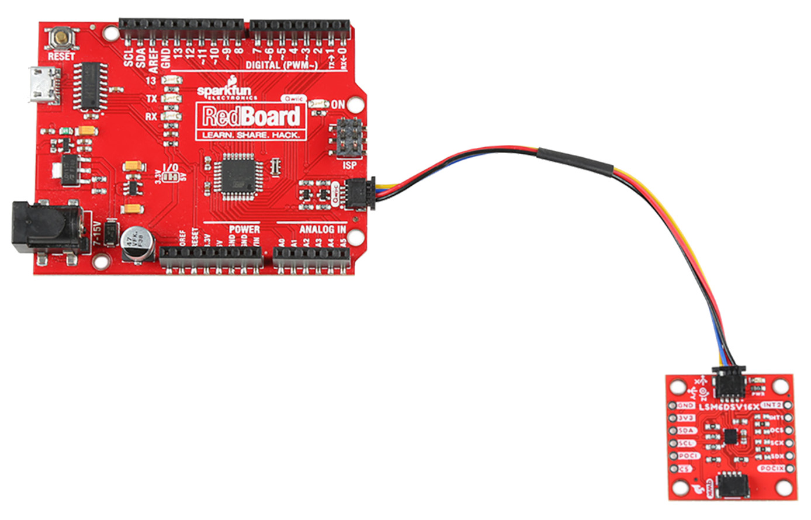
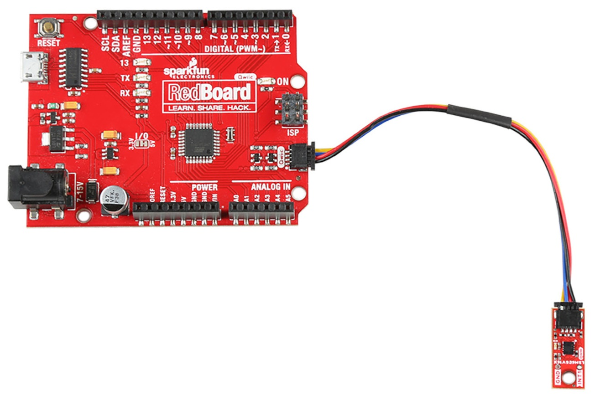
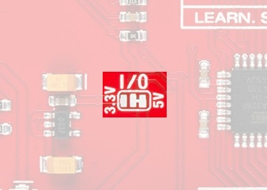

The delightful thing about our Qwiic boards is that they are quite literally plug and play. 

<figure markdown>
[{ width="400" }](assets/imgs/21325_6DOF_5.jpg "Click to enlarge")
<figcaption markdown>SparkFun 6DoF - LSM6DSV16X (Qwiic) Plugged into the RedBoard Qwiic</figcaption>
</figure>

<figure markdown>
[{ width="400" }](assets/imgs/21336_Micro6DOF_5.jpg "Click to enlarge")
<figcaption markdown>SparkFun 6DoF Micro - LSM6DSV16X (Qwiic)  Plugged into the RedBoard Qwiic</figcaption>
</figure>

!!! attention
	If you are using the SparkFun RedBoard Qwiic, make sure that you have your I/O jumper set correctly. You'll find the 3V3 vs 5V jumper on the front of the RedBoard Qwiic. You'll need to cut the connective trace to 5V and solder the center jumper pad to the 3V3 pad in order for the examples to work. More information can be found in the [RedBoard Qwiic Hookup Guide](https://learn.sparkfun.com/tutorials/redboard-qwiic-hookup-guide/all#hardware-overview). 

	<figure markdown>
	[{ width="90%" }](assets/imgs/Qwiic_Redboard_-_IO_Jumper.jfif "Click to enlarge")
	<figcaption markdown>3V3/5V Jumper on the RedBoard</figcaption>
	</figure>
