###Accelerometer - LSM6DSV16X

The LSM6DSV16X Accelerometer from STMicroelectronics has a few different modes: 

* Mode 1: Periperhal only mode - I2C or SPI
* Mode 2: Sensor hub mode - I2C or SPI with controller I2C port
* Mode 3 and 4: AUX SPI mode I2C and SPI access multi-read

<table class="pdf" style="border-style:none;" markdown="1">
<tbody markdown="1">
<tr markdown="1">
<td align="center" width="35%" markdown="block">
[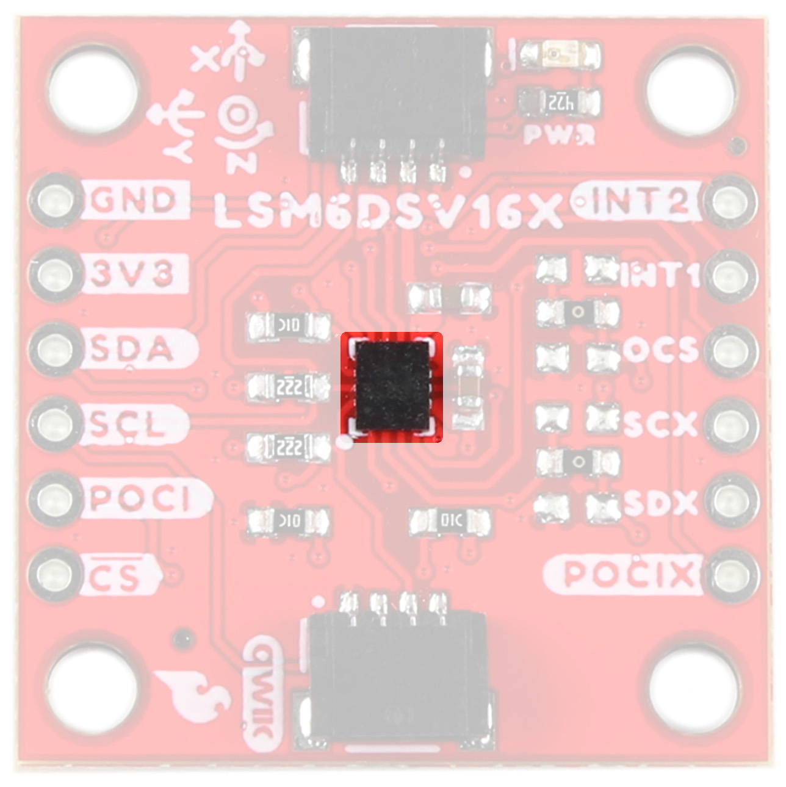{ width=90% }](assets/imgs/21325_SparkFun_LSM6DSV16X_IC.jpg)
</td>
<td align="center" width="35%" markdown="block">
[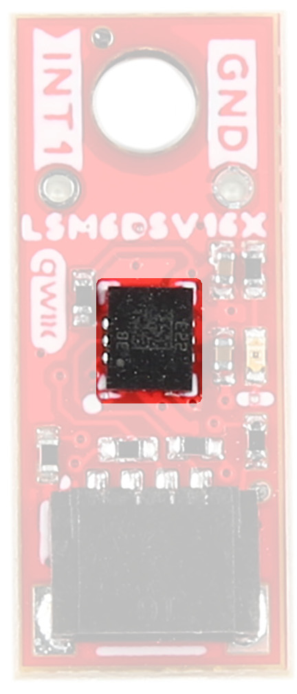{ width=40% }](assets/imgs/21336_SparkFun_Micro_LSM6DSV16X_IC.jpg)
</td>
</tr>
</tbody>
</table>

#### Mode 1
This is the default "peripheral only" mode. This mode allows you to use either I2C or SPI. By default, I2C is enabled with an address of 0x6B. By manipulating the associated jumper, you can change the I2C address to 0x6A (cut the power side and close the ground side) or switch to SPI mode (both jumpers open).

#### Mode 2
This mode enables a secondary I2C port that the 6DoF controls; up to 4 external sensors can be connected to the I2C controller interface of the device. External sensors communicate via the SCX and SDX (PICOX) lines - the SCX and SDX jumpers will need to be opened.

#### Modes 3 & 4
In addition to the primary I2C peripheral interface or SPI (3- / 4-wire) serial interface, an auxiliary SPI (3- / 4-wire) serial interface is available for external device connections (i.e. camera module). Mode 3 is available for gyroscope only, Mode 4 is available for both gyroscope and accelerometer.

The analog hub and Qvar functionalities are available in mode 1 with I²C interface only.

###Qwiic Connector

The Qwiic connector(s) on the SparkFun 6DoF - LSM6DSV16X (Qwiic) and SparkFun 6DoF Micro - LSM6DSV16X (Qwiic) provide power and I2C connectivity simultaneously.

<table class="pdf" style="border-style:none;" markdown="1">
<tbody markdown="1">
<tr markdown="1">
<td align="center" width="35%" markdown="block">
[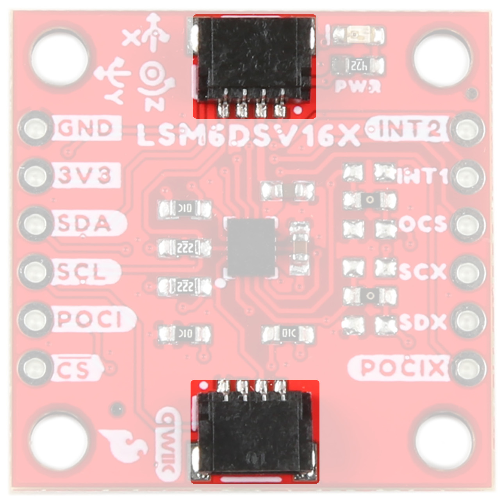{ width=90% }](assets/imgs/21325_SparkFun_LSM6DSV16X_QwiicConnex.jpg)
</td>
<td align="center" width="35%" markdown="block">
[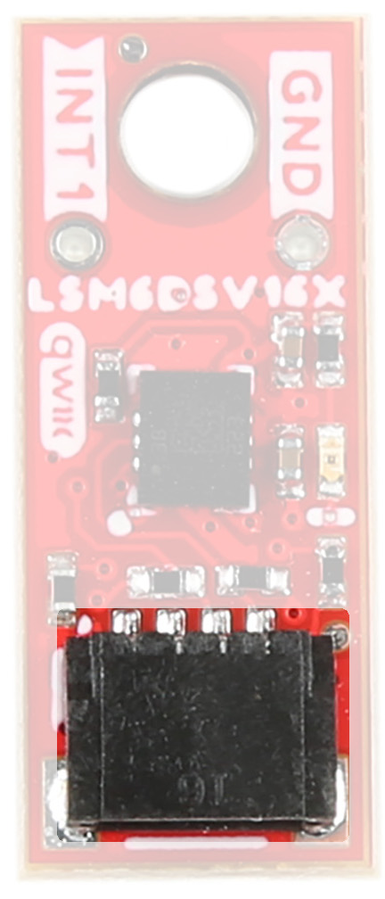{ width=40% }](assets/imgs/21336_SparkFun_Micro_LSM6DSV16X_QwiicConnex.jpg)
</td>
</tr>
</tbody>
</table>

###Power

Ideally, power to these boards will be provided by the Qwiic cables. However, should you wish to provide power separately, the 1" x 1" board has its pins broken out to PTH and you can wire up power via these. 

!!! warning
    
Make sure to pay attention to logic levels - supply voltage range should be between 1.71V - 3.6V. 

<figure markdown>
[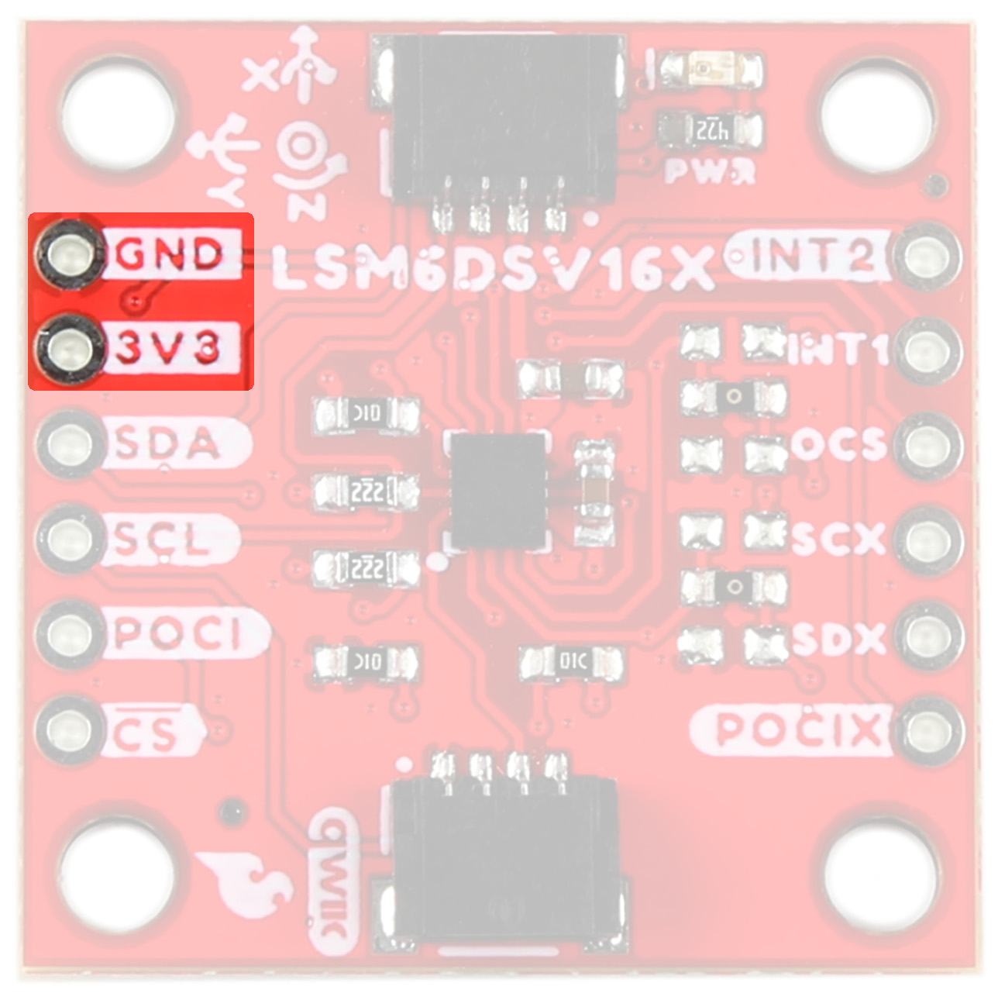{ width="400" }](assets/imgs/21325_SparkFun_LSM6DSV16X_PowerPins.jpg" Click to enlarge")
<figcaption markdown>LSM6DSV16X Power Pins</figcaption>
</figure>

###GPIO

This is a quick overview of the pin functionality. For more information, refer to the [datasheet](assets/BoardFiles/lsm6dsv16x.pdf). 

#### I2C

If you do not want to use the Qwiic connectors, I2C functionality has been broken out to PTH pins on the 1x1" board. 

<figure markdown>
[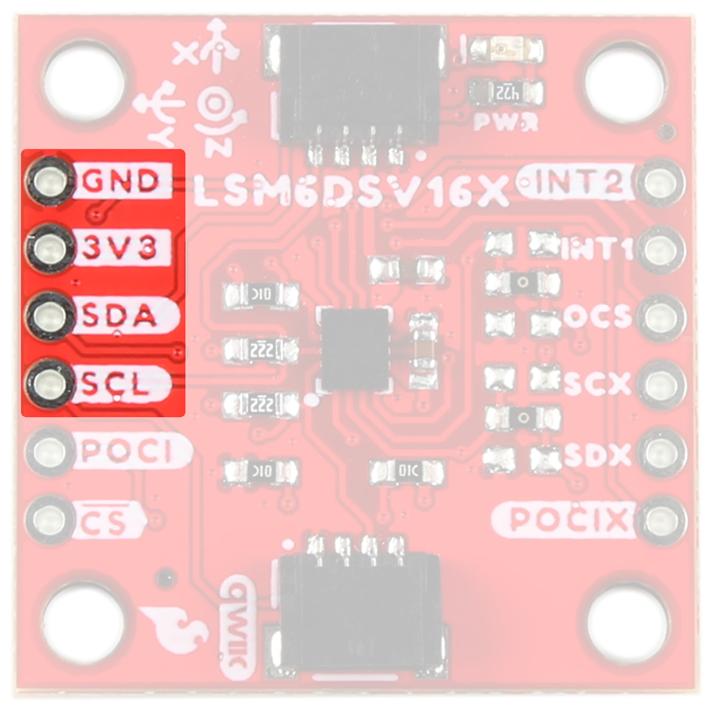{ width="400" }](assets/imgs/21325_SparkFun_LSM6DSV16X_I2CPins.jpg" Click to enlarge")
<figcaption markdown>LSM6DSV16X I2C Pins</figcaption>
</figure>

#### SPI

Primary SPI functionality has been broken out to the highlighted pins below. 

<figure markdown>
[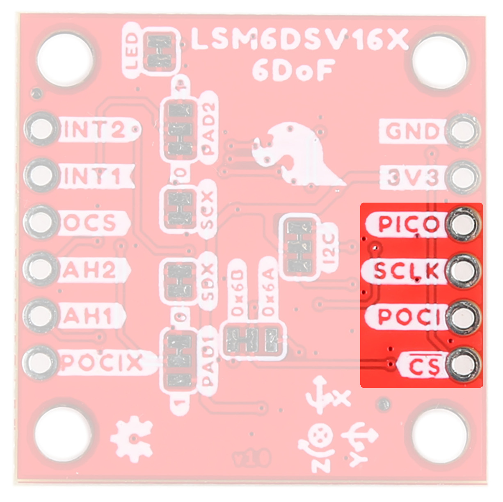{ width="400" }](assets/imgs/21325_SparkFun_LSM6DSV16X_SPIPins.jpg" Click to enlarge")
<figcaption markdown>LSM6DSV16X SPI Pins</figcaption>
</figure>

Auxiliary SPI is available via AH1, AH2, and OCS. 

<figure markdown>
[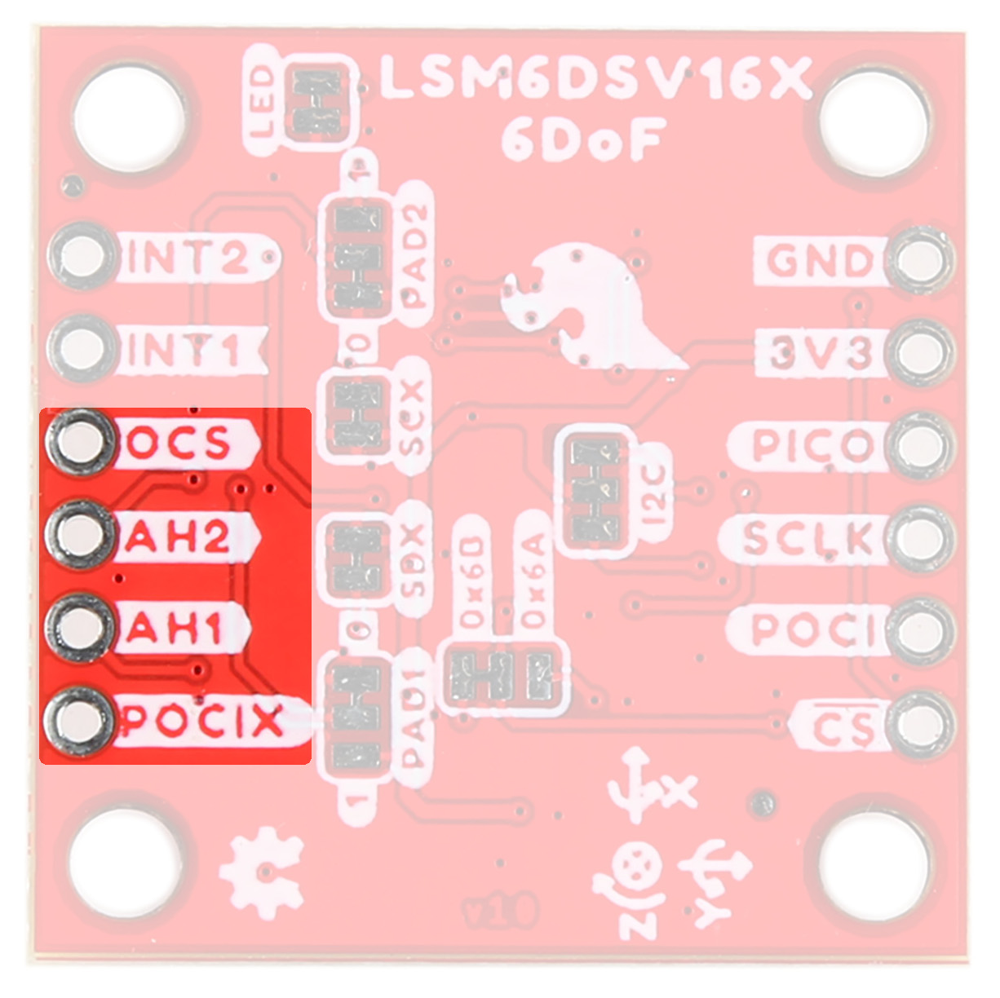{ width="400" }](assets/imgs/21325_SparkFun_LSM6DSV16X_AuxSPIPins.jpg" Click to enlarge")
<figcaption markdown>LSM6DSV16X Aux SPI Pins</figcaption>
</figure>

#### AH1/AH2

The LSM6DSV16X embeds Qvar functionality, which is an electrostatic sensor able to measure the variation of the quasi-electrostatic potential. The Qvar sensing channel can be used for user interface applications like tap, double tap, triple tap, long press, and L/R – R/L swipe. Functionality is accessed via the AH1 and AH2 pins. For more information, refer to STMicroelectronics' [Qvar Sensing Channel Application Notes](https://www.st.com/resource/en/application_note/an5755-qvar-sensing-channel--stmicroelectronics.pdf). 

<figure markdown>
[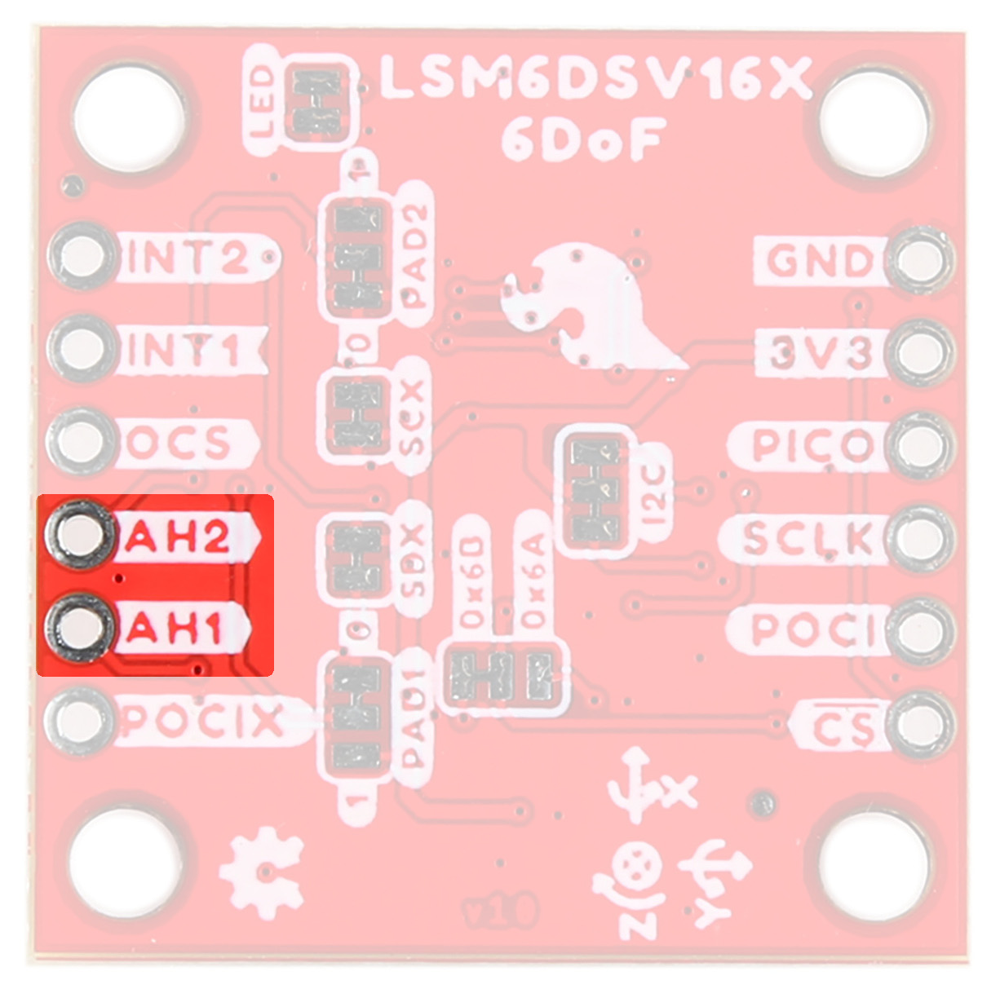{ width="400" }](assets/imgs/21325_SparkFun_LSM6DSV16X_QvarPins.jpg" Click to enlarge")
<figcaption markdown>LSM6DSV16X Qvar Pins</figcaption>
</figure>

#### Interrupt Pins

Interrupt functionality is available via the INT pins. There are two interrupts available on the 1x1" board, and 1 interrupt available on the Micro. These pins are configurable to be high or low. 

<table class="pdf" style="border-style:none;" markdown="1">
<tbody markdown="1">
<tr markdown="1">
<td align="center" width="35%" markdown="block">
[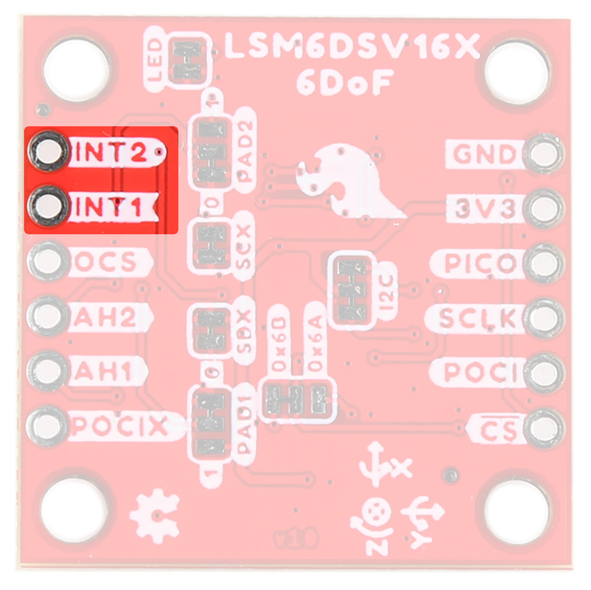{ width=90% }](assets/imgs/21325_SparkFun_LSM6DSV16X_InterruptPins.jpg)
</td>
<td align="center" width="35%" markdown="block">
[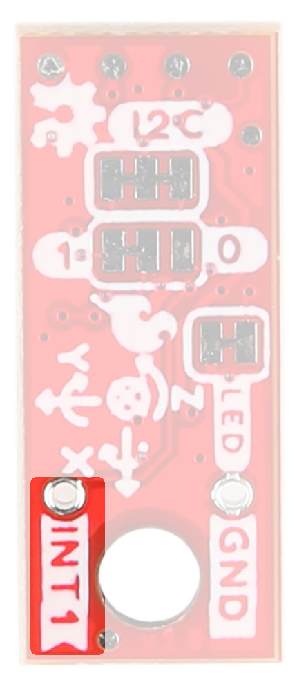{ width=40% }](assets/imgs/21336_SparkFun_Micro_LSM6DSV16X_InterruptPin.jpg)
</td>
</tr>
</tbody>
</table>

###Jumpers 

####I2C

Like our other Qwiic boards, the Qwiic 6DoF - LSM6DSV16X boards come equipped with pull-up resistors on the clock and data pins. If you are daisy-chaining multiple Qwiic devices, you will want to cut this jumper; if multiple sensors are connected to the bus with the pull-up resistors enabled, the parallel equivalent resistance will create too strong of a pull-up for the bus to operate correctly. As a general rule of thumb, disable all but one pair of pull-up resistors if multiple devices are connected to the bus. To disable the pull up resistors, use an X-acto knife to cut the joint between the two jumper pads highlighted below.

<table class="pdf" style="border-style:none;" markdown="1">
<tbody markdown="1">
<tr markdown="1">
<td align="center" width="35%" markdown="block">
[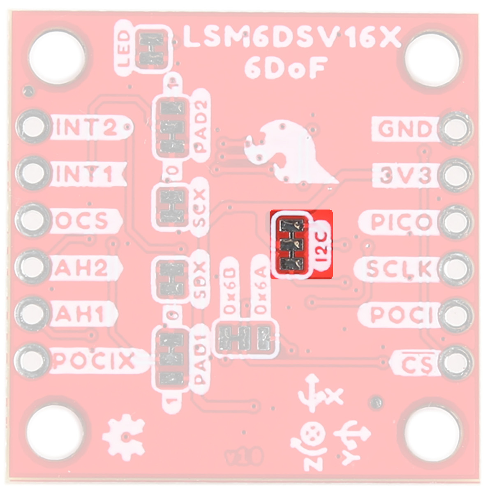{ width=90% }](assets/imgs/21325_SparkFun_LSM6DSV16X_I2CJumper.jpg)
</td>
<td align="center" width="35%" markdown="block">
[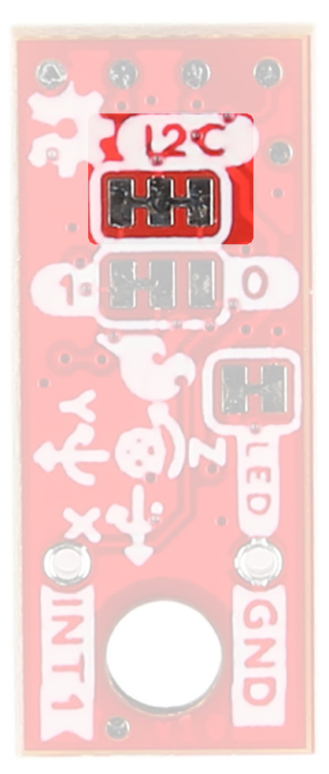{ width=40% }](assets/imgs/21336_SparkFun_Micro_LSM6DSV16X_I2CJumper.jpg)
</td>
</tr>
</tbody>
</table>

####I2C Address

The SparkFun 6DoF - LSM6DSV16X (Qwiic) boards have a default I2C address of 0x6B, but by cutting the address jumper on the back of the board, you can select 0x6A (GND) or SPI (fully open). 

<table class="pdf" style="border-style:none;" markdown="1">
<tbody markdown="1">
<tr markdown="1">
<td align="center" width="35%" markdown="block">
[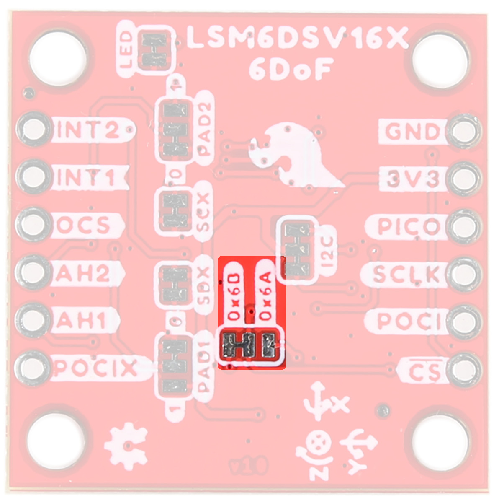{ width=90% }](assets/imgs/21325_SparkFun_LSM6DSV16X_AddressJumper.jpg)
</td>
<td align="center" width="35%" markdown="block">
[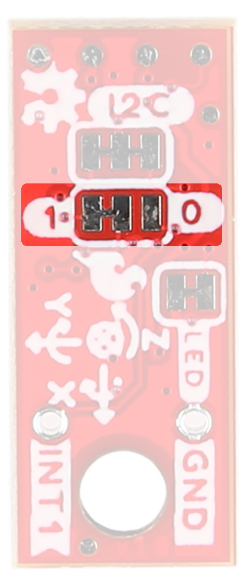{ width=40% }](assets/imgs/21336_SparkFun_Micro_LSM6DSV16X_AddressJumper.jpg)
</td>
</tr>
</tbody>
</table>

####SDX/SCX

If using either Mode 2 (sensor hub mode) or the analog capabilities of the sensor, cut both of these traces. 

<figure markdown>
[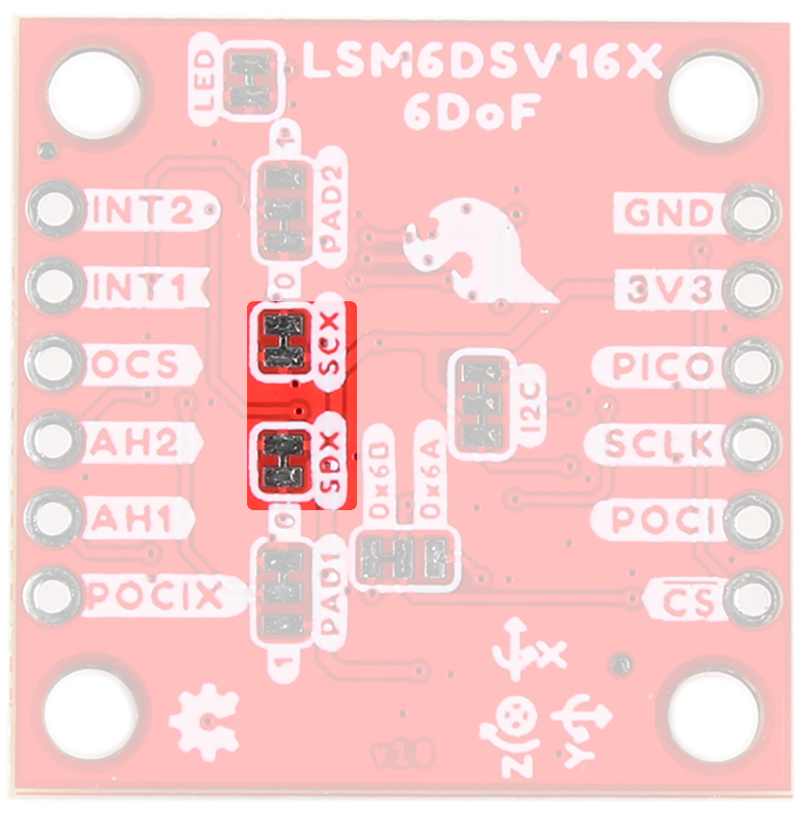{ width="400" }](assets/imgs/21325_SparkFun_LSM6DSV16X_SCXSDXJumpers.jpg "Click to enlarge")
<figcaption markdown>LSM6DSV16X SCX/SDX Jumpers</figcaption>
</figure>

####Pad Jumpers

When using the Analog In (QVar) functionality, you can select whether P1 is tied to GND or 3v3 using the PAD1 jumper. Similarly, you can select whether P2 is tied to GND or 3v3 using the PAD2 jumper. Refer to either the [application notes](https://www.st.com/en/mems-and-sensors/lsm6dsv16x.html#documentation) for more information. 

<figure markdown>
[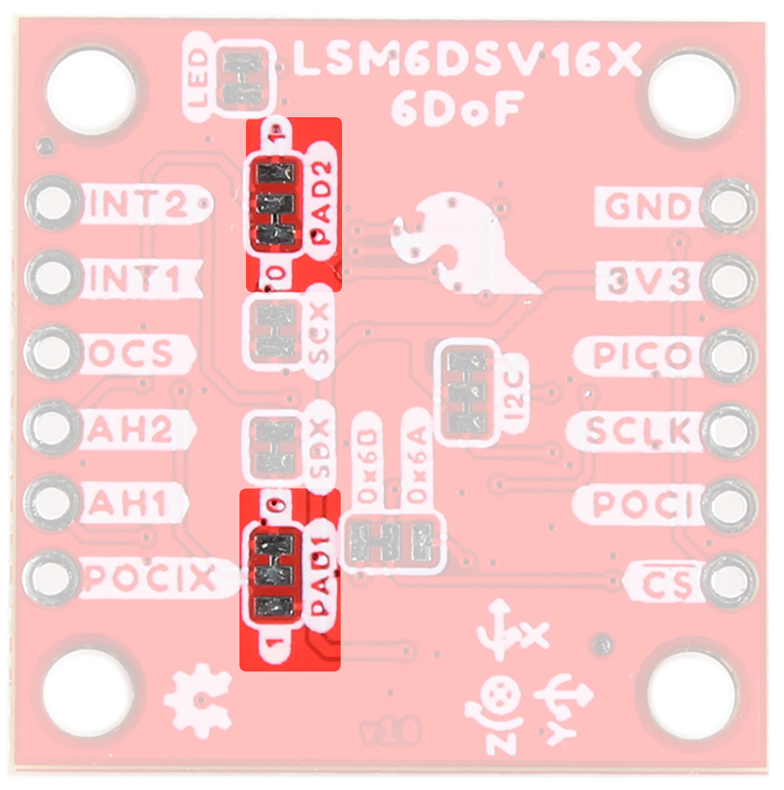{ width="400" }](assets/imgs/21325_SparkFun_LSM6DSV16X_PadJumpers.jpg "Click to enlarge")
<figcaption markdown>LSM6DSV16X Pad Jumpers</figcaption>
</figure>

####LED

Let there be light! Or not. An LED on the front of each board indicates power is being provided to the board. If you don't like LEDs or you are concerned about current draw, cut the jumper highlighted below. 

<table class="pdf" style="border-style:none;" markdown="1">
<tbody markdown="1">
<tr markdown="1">
<td align="center" width="35%" markdown="block">
[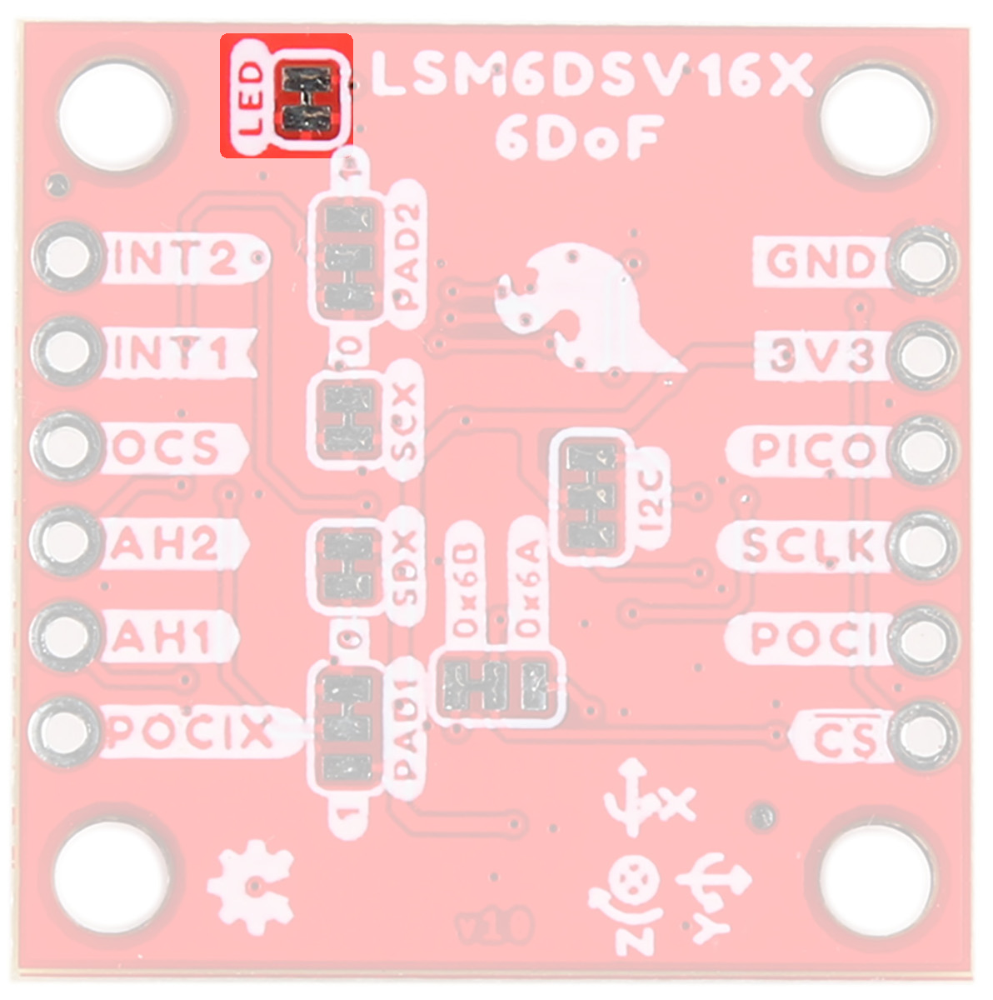{ width=90% }](assets/imgs/21325_SparkFun_LSM6DSV16X_LEDJumper.jpg)
</td>
<td align="center" width="35%" markdown="block">
[{ width=40% }](assets/imgs/21336_SparkFun_Micro_LSM6DSV16X_LEDJumper.jpg)
</td>
</tr>
</tbody>
</table>

###Board Outline

The SparkFun 6DoF - LSM6DSV16X (Qwiic) follows the standard 1" x 1" convention of most of our Qwiic breakout boards. 

<figure markdown>
[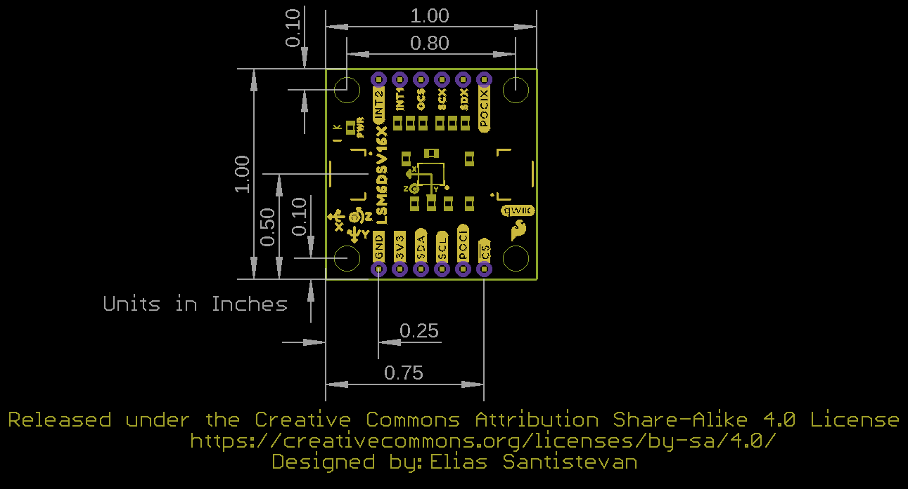{ width=90% }](assets/BoardFiles/SparkFun_6DoF_LSM6DSV16X-BoardOutline.png "Click to enlarge")
<figcaption markdown>SparkFun 6DoF - LSM6DSV16X (Qwiic)</figcaption>
</figure>

The SparkFun 6DoF Micro - LSM6DSV16X (Qwiic) measures 0.3" x 0.75". 

<figure markdown>
[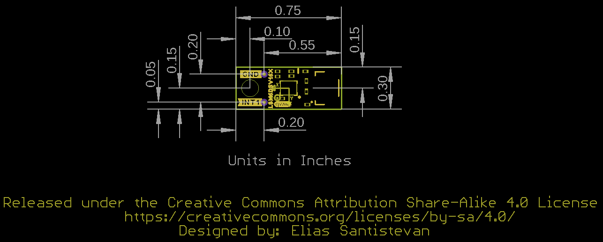{ width=90% }](assets/BoardFiles/SparkFun_Micro_6DoF_LSM6DSV16X-BoardOutline.png "Click to enlarge")
<figcaption markdown>SparkFun 6DoF Micro - LSM6DSV16X (Qwiic)</figcaption>
</figure>

